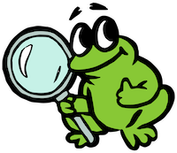

<p align="center">
  
</p>

# ProofFrog

**A tool for checking transitions in cryptographic game-hopping proofs.**

ProofFrog checks the validity of game hops for cryptographic game-hopping proofs in the reduction-based security paradigm: it checks that the starting and ending games match the security definition, and that each adjacent pair of games is either interchangeable (by code equivalence) or justified by a stated assumption. Proofs are written in FrogLang, a small C/Java-style domain-specific language designed to look like a pen-and-paper proof. ProofFrog can be used from the command line, a browser-based editor, or an MCP server for integration with AI coding assistants. ProofFrog is suitable for introductory level proofs, but is not as expressive for advanced concepts as other verification tools like EasyCrypt.

## Getting started

**[Read the manual]()** for [installation](), [tutorials](), [worked examples](), and a complete [language reference]().

**[Browse the examples page]()** for a catalogue of proofs ProofFrog can currently analyze.

**Researchers**: see [the research section of this website]() for the scientific background, engine internals, soundness story, publications, and links to presentations/demos from past events.

Checking your first proof is as easy as:

```bash
pip install proof_frog
proof_frog download-exmaples
proof_frog prove examples/Proofs/PubKeyEnc/HybridKEMDEM_INDCPA_MultiChal.proof
```

See the [installation instructions]() for details.

## Participate on GitHub

[ProofFrog's GitHub site](https://github.com/ProofFrog) is the place to go to download the ProofFrog source code and examples, [ask questions](https://github.com/orgs/ProofFrog/discussions), and contribute issues or pull requests. ProofFrog is released under the [MIT License](https://github.com/ProofFrog/ProofFrog/blob/main/LICENSE).

## Recent updates

- **Apr. 11, 2026: Release of [ProofFrog version 0.4.0](https://github.com/ProofFrog/ProofFrog/releases/tag/v0.4.0)** featuring significant language additions, many engine soundness fixes and new transforms, a redesigned web interface, and new tooling features
- Apr. 11, 2025: Release of [ProofFrog VS Code Extension version 0.1.0](https://marketplace.visualstudio.com/items?itemName=ProofFrog.prooffrog) on VS Code Extension Marketplace
- Mar. 6, 2026: [ProofFrog discussions and demos at HACS 2026](http://prooffrog.github.io/researchers/publications/hacs-2026/)
- **Mar. 5, 2026: Release of [ProofFrog version 0.3.1](https://github.com/ProofFrog/ProofFrog/releases/tag/v0.3.1)** featuring a web interface and engine updates

## Acknowledgements

ProofFrog was created by Ross Evans and Douglas Stebila, building on the pygamehop tool created by Douglas Stebila and Matthew McKague. For more information about ProofFrog's design, see [Ross Evans' master's thesis](https://uwspace.uwaterloo.ca/bitstream/handle/10012/20441/Evans_Ross.pdf) and [eprint 2025/418](https://eprint.iacr.org/2025/418).

ProofFrog's syntax and approach to modelling is heavily inspired by Mike Rosulek's excellent book [*The Joy of Cryptography*](https://joyofcryptography.com/).

We acknowledge the support of the Natural Sciences and Engineering Research Council of Canada (NSERC).


