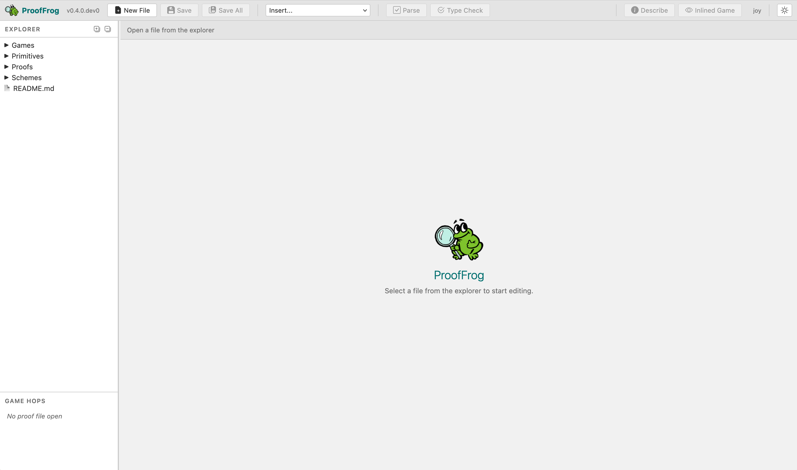
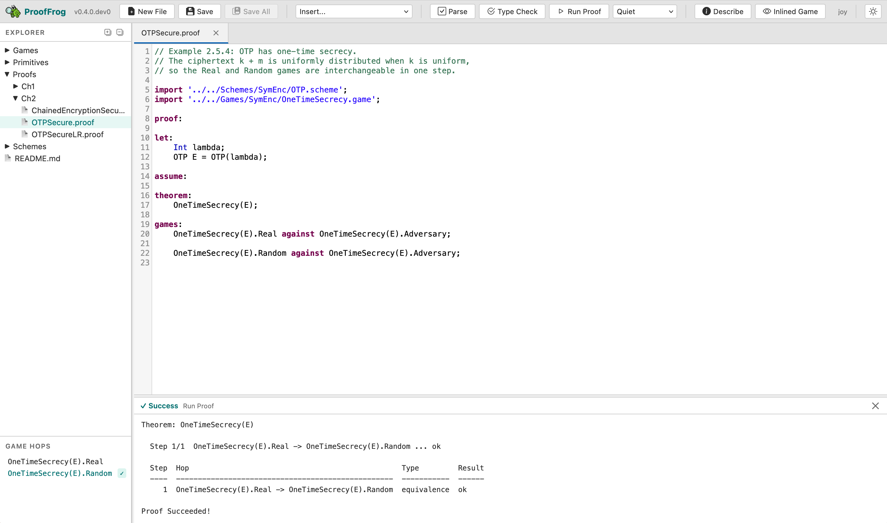
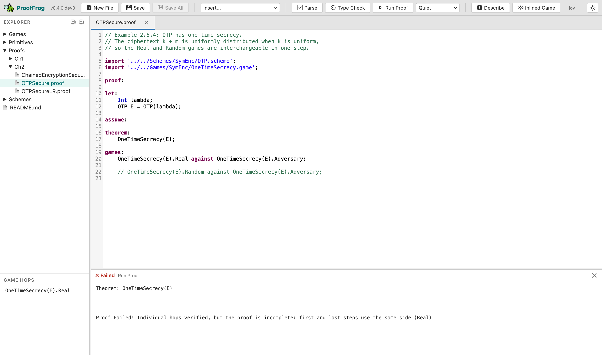

# Tutorial Part 1 — Hello Frog
{: .no_toc }

In this tutorial you will run your first ProofFrog proof, break it on purpose to see what a failing proof looks like, and fix it again. You will not write any FrogLang yourself — the goal is simply to get comfortable with the tool before writing anything from scratch.

---

- TOC
{:toc}

---

## Prerequisites

Make sure you've [installed ProofFrog]().

## Get the examples

Download the ProofFrog examples:

```bash
proof_frog download-examples
```

This creates an `examples/` directory containing primitives, schemes, games, and proofs from introductory cryptography. The rest of this tutorial assumes you ran this command in your current working directory, so that the path `examples/joy/` exists.

## Launch the web editor

{: .important }
**Activate your virtual environment first.** If you followed the [installation instructions](), ProofFrog is installed inside a Python virtual environment and you need to activate it in every new terminal before running `proof_frog`. On macOS/Linux with bash or zsh, that is `source .venv/bin/activate`; on fish, `source .venv/bin/activate.fish`; on Windows PowerShell, `.venv\Scripts\Activate.ps1`. Your prompt should show `(.venv)` once it is active.

Start the web editor pointed at the `joy` example folder:

```bash
proof_frog web examples/joy
```

ProofFrog starts a local web server on port 5173 and opens your browser automatically. You should see a file tree on the left and an editor pane on the right.

{: .lightbox }

## Run a successful proof

In the file tree, open `Proofs/Ch2/OTPSecure.proof`. Click the **Run Proof** button in the toolbar. After a moment the output panel should turn green and report that the proof succeeded.

{: .lightbox }

> **CLI alternative.** You can prove the same file from the command line:
> ```bash
> proof_frog prove examples/joy/Proofs/Ch2/OTPSecure.proof
> ```
> The web editor and the CLI call the same underlying engine; the two paths produce identical results.
{: .note }

## Break it on purpose

Open `Proofs/Ch2/OTPSecure.proof` in the editor. In the `games:` block, comment out the second line — the one that reads:

```
OneTimeSecrecy(E).Random against OneTimeSecrecy(E).Adversary;
```

Add a `//` at the start so it becomes:

```
// OneTimeSecrecy(E).Random against OneTimeSecrecy(E).Adversary;
```

Click **Run Proof** again. This time the status badge in the output panel turns red and shows **✗ Failed**, while the body text reports something like:

```
Proof Failed! Individual hops verified, but the proof is incomplete: 
first and last steps use the same side (Real)
```

ProofFrog is telling you that both endpoints of the game sequence are on the `Real` side of the security property, which means the proof never actually reaches the `Random` side — the chain is broken.

{: .lightbox }

## Fix it

Remove the `//` to restore the line, then click **Run Proof** one more time. The output turns green again.

## What happened when you clicked "Run Proof"

ProofFrog checked that each adjacent pair of games in the `games:` sequence is interchangeable — meaning the two games are equivalent under the semantics of FrogLang, as verified by the engine's canonicalization and equivalence-checking machinery. The proof of `OTPSecure` succeeds because the single hop from `Real` to `Random` is one such equivalence: the ProofFrog engine knows XORing a uniformly random key (used only once) with a message produces a uniformly random ciphertext, so the real and random games are indistinguishable. In Part 2 of the tutorial, you will write this exact proof from scratch.
