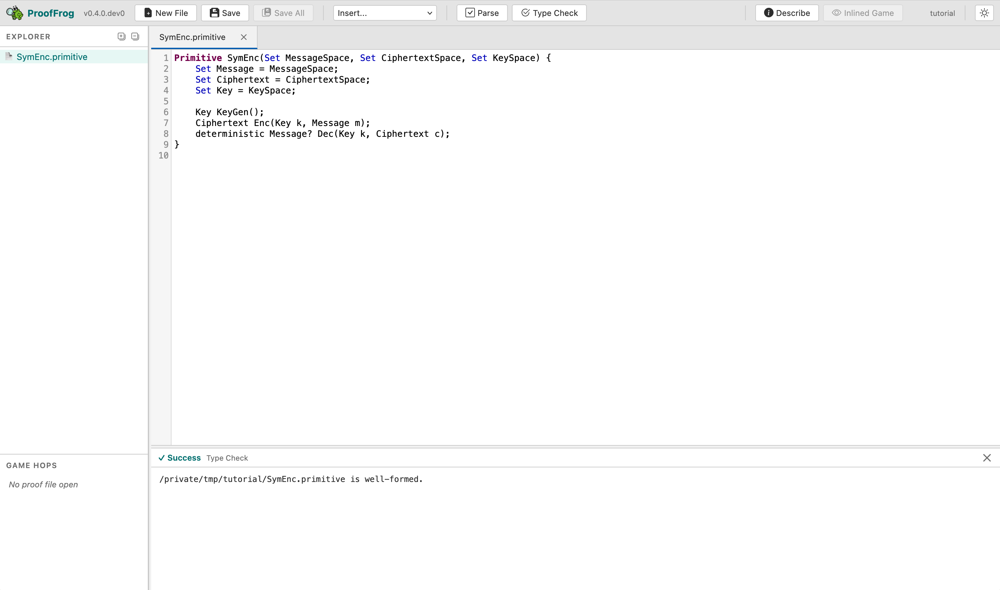
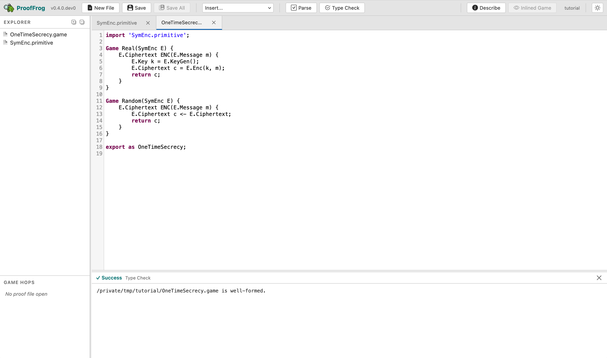
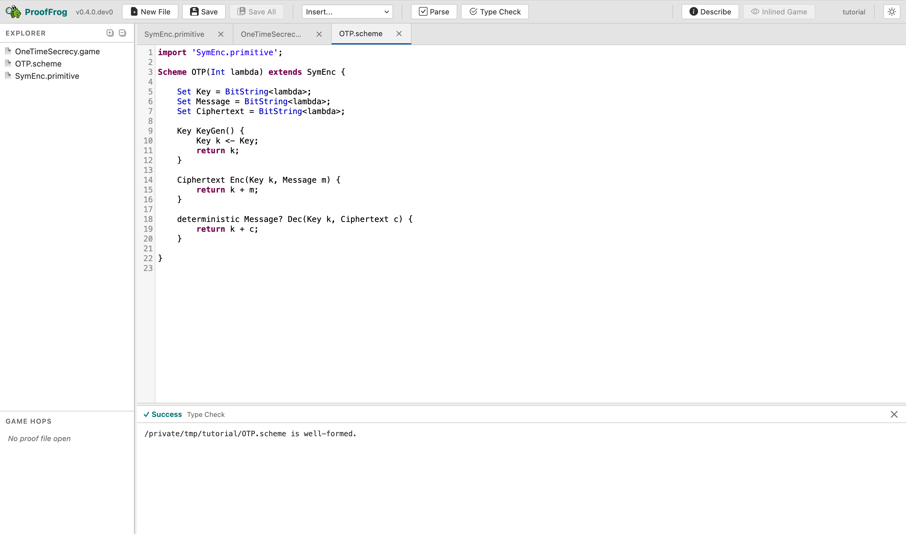
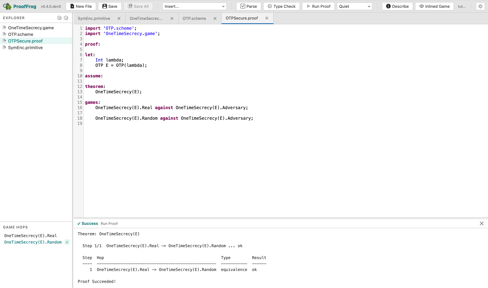
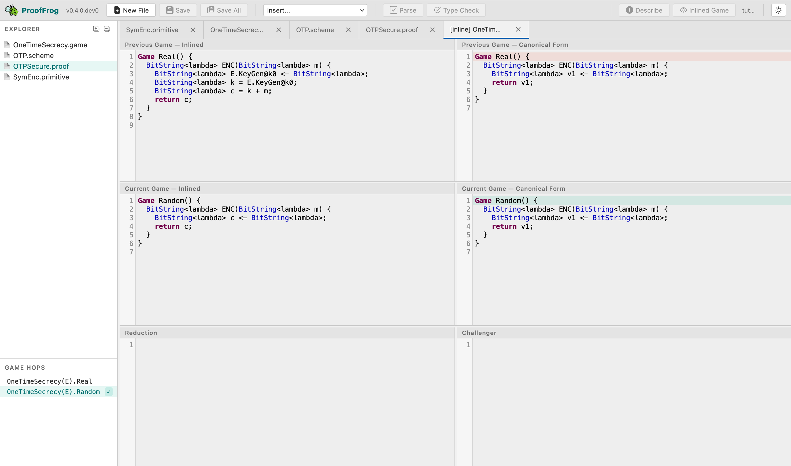

# Tutorial Part 2 — One-time pad has one-time secrecy
{: .no_toc }

In Tutorial Part 1, you ran an existing proof that that the one-time pad has one-time secrecy, broke it on purpose, and fixed it again. Now you will write that proof from scratch — all four files of it. By the end of this tutorial you will have defined a cryptographic primitive, a security game, a concrete scheme, and a game-hopping proof file, and you will have seen each one type-check or prove green as you finish it. We follow [Joy of Cryptography Section 2.5](https://joyofcryptography.com/provsec/#sec.abstract-defs) closely; if you have Rosulek's textbook handy, keep it open. Everything you write here is already in the `examples/joy/` directory, so you can always peek at the finished version if you get stuck.

{: .important }
**Activate your virtual environment first.** Before running any `proof_frog` command in a fresh terminal, activate the Python virtual environment you created during [installation](): `source .venv/bin/activate` on macOS/Linux (bash/zsh), `source .venv/bin/activate.fish` on fish, or `.venv\Scripts\Activate.ps1` on Windows PowerShell. Your prompt should show `(.venv)` once it is active.

---

- TOC
{:toc}

---

## Step 1: Define the SymEnc primitive

*Joy of Cryptography parallel:* This step encodes Definition 2.5.1 from [Joy of Cryptography](https://joyofcryptography.com/provsec/#sec.abstract-defs:~:text=Definition%202%2E5%2E1%20%28Syntax%20of%20symmetric%2Dkey%20encryption), which defines what a symmetric encryption scheme is: a key space, a message space, a ciphertext space, and three algorithms (KeyGen, Enc, Dec).

### What a primitive is

A **primitive** in FrogLang is a named interface: it declares what sets and methods a cryptographic scheme must provide, without saying anything about how those methods work. Think of it as the abstract type signature that any concrete scheme (like OTP) must satisfy. The one-time pad scheme is a symmetric encryption scheme, so we have to define the primitive of "symmetric encryption".

### Building the file, line by line

In the web editor, use the "New File" button to create a new file called `SymEnc.primitive`.

Start with the opening line:

```prooffrog
Primitive SymEnc(Set MessageSpace, Set CiphertextSpace, Set KeySpace) {
```

The keyword `Primitive` introduces a primitive definition. The name `SymEnc` is what other files will use to refer to it. The parenthesized list `(Set MessageSpace, Set CiphertextSpace, Set KeySpace)` declares three **parameters** of kind `Set` — later, you will have to supply the three spaces when instantiating a scheme. Parameters of kind `Set` represent abstract sets; they have no internal structure until a scheme binds them to concrete types.

Next, declare the three named fields:

```prooffrog
    Set Message = MessageSpace;
    Set Ciphertext = CiphertextSpace;
    Set Key = KeySpace;
```

These `Set X = Y;` lines create named slots that can be referred to later: if we eventually have a symmetric encryption scheme `E`, then we will be able to refer to `E.Message`, `E.Ciphertext`, and `E.Key`. The right-hand side binds the slot to the corresponding parameter. Without these lines, the three parameter names would not be accessible outside the primitive block.

Now declare the three method signatures:

```prooffrog
    Key KeyGen();
    Ciphertext Enc(Key k, Message m);
    deterministic Message? Dec(Key k, Ciphertext c);
```

Primitives declare **method signatures only** — there are no method bodies here. Every scheme that extends `SymEnc` must implement all three methods with exactly these signatures.

Two new language features appear here:

- `Message?` — the `?` suffix denotes a **nullable** (optional) type. In a symmetric encryption scheme, the decryption algorithm  `Dec` returns either a `Message` or `None`; decryption is allowed to fail if the ciphertext is invalid. If we later create a scheme returning just plain `Message` where the primitive declared `Message?`, we will get a type mismatch that the engine will catch.
- `deterministic` — this modifier on `Dec` tells the engine that `Dec` is a deterministic algorithm that always returns the same output for the same inputs. In general, algorithms in FrogLang are assumed to be probabilistics, unless explicitly declared to be deterministic. We will come back to why this matters in Step 4 when the proof engine uses it to justify certain algebraic simplifications.

Finally, add a brace to close the block:

```prooffrog
}
```

### The complete file

```prooffrog
Primitive SymEnc(Set MessageSpace, Set CiphertextSpace, Set KeySpace) {
    Set Message = MessageSpace;
    Set Ciphertext = CiphertextSpace;
    Set Key = KeySpace;

    Key KeyGen();
    Ciphertext Enc(Key k, Message m);
    deterministic Message? Dec(Key k, Ciphertext c);
}
```

### Check it

Click **Type Check** in the toolbar. You should see:

```
SymEnc.primitive is well-formed.
```

{: .lightbox }

> **CLI alternative.** From your working directory:
> ```bash
> proof_frog check SymEnc.primitive
> ```
{: .note }

#### What if it fails
{: .no_toc }

**Parse error / unexpected token.** The most common cause is a missing semicolon. Every field declaration and every method signature must end with `;`. The error message will cite a line number; look there first.

**`Message` cannot be used where `Message?` is expected.** If you wrote `Message Dec(...)` instead of `Message? Dec(...)`, the type-checker will flag a mismatch when you later try to run the proof. Add the `?`.

---

## Step 2 — Define the one-time secrecy security property

*Joy of Cryptography parallel:* This step encodes Definition 2.5.3 from [Joy of Cryptography](https://joyofcryptography.com/provsec/#sec.abstract-defs:~:text=Definition%202%2E5%2E3%20%28One%2Dtime%20secrecy), which defines one-time secrecy as the indistinguishability of an encryption oracle from a random-ciphertext oracle.

### What a security property is

A **security property** in FrogLang is always a *pair* of games exported under a single name. The adversary is given access to one of the two games but not told which one; security means the adversary cannot reliably distinguish them. This is the left/right (or Real/Random) formulation of indistinguishability used throughout Joy of Cryptography.

The engine requires both games in a pair to expose the exact same method signatures — same names, same parameter types, same return types. The adversary interacts with both games through the same interface; only the internals differ.

### Building the file, line by line

Create `OneTimeSecrecy.game`.

Start with the import:

```prooffrog
import 'SymEnc.primitive';
```

The `import` keyword loads another file and makes its definitions available in the current file. The path is **relative to the directory containing the importing file**. For now we've put all the files in the same folder, but eventually you might have to reference files from different folders, like `../../Primitives/SymEnc.primitive`.

Now write the first game:

```prooffrog
Game Real(SymEnc E) {
    E.Ciphertext ENC(E.Message m) {
        E.Key k = E.KeyGen();
        E.Ciphertext c = E.Enc(k, m);
        return c;
    }
}
```

The `Game` keyword introduces a game definition. `Real` is its name. The parameter `(SymEnc E)` says this game is parameterized by a scheme `E` that implements the `SymEnc` primitive. Inside the game there is one oracle method, `ENC`, which generates a fresh key, encrypts the adversary's message under that key, and returns the ciphertext.

Now write the second game:

```prooffrog
Game Random(SymEnc E) {
    E.Ciphertext ENC(E.Message m) {
        E.Ciphertext c <- E.Ciphertext;
        return c;
    }
}
```

The `<-` operator is **uniform random sampling**. The line `E.Ciphertext c <- E.Ciphertext;` samples a uniformly random element from `E.Ciphertext` and assigns it to variable `c`. The adversary's message `m` is accepted but not used — the ciphertext is chosen at random regardless of the plaintext. This captures the intuition that a secure encryption scheme's ciphertexts look random.

Notice that both `Real` and `Random` expose an oracle named `ENC` with the same signature: `E.Ciphertext ENC(E.Message m)`. This is mandatory — the engine will reject a game pair with mismatched oracle signatures.

Finally, export the pair under a single name:

```prooffrog
export as OneTimeSecrecy;
```

The `export as` line gives the two-game pair a single name — `OneTimeSecrecy` — that proof files use when stating a theorem. After this line, `OneTimeSecrecy(E).Real` and `OneTimeSecrecy(E).Random` refer to the two games.

### The complete file

```prooffrog
// Definition 2.5.3: One-time secrecy
// A scheme has one-time secrecy if encrypting any message produces
// a ciphertext indistinguishable from a uniformly random ciphertext.

import 'SymEnc.primitive';

Game Real(SymEnc E) {
    E.Ciphertext ENC(E.Message m) {
        E.Key k = E.KeyGen();
        E.Ciphertext c = E.Enc(k, m);
        return c;
    }
}

Game Random(SymEnc E) {
    E.Ciphertext ENC(E.Message m) {
        E.Ciphertext c <- E.Ciphertext;
        return c;
    }
}

export as OneTimeSecrecy;
```

### Check it

Click **Type Check** in the web editor, or on the command-line run:

```bash
proof_frog check OneTimeSecrecy.game
```

Expected output:

```
OneTimeSecrecy.game is well-formed.
```

{: .lightbox }


#### What if it fails: mismatched oracle signatures
{: .no_toc }

The most instructive mistake here is giving the two games oracles with different signatures. For example, suppose you accidentally added an extra parameter to `Random.ENC`:

```prooffrog
// Wrong: extra parameter that Real.ENC does not have
E.Ciphertext ENC(E.Message m, E.Message extra) {
```

The engine rejects this at the type-checking stage with an error like:

```
OneTimeSecrecy.game:8:4: error: Method 'ENC' has different signatures in Real and Random: E.Ciphertext ENC(E.Message m) vs E.Ciphertext ENC(E.Message m, E.Message extra)
    E.Ciphertext ENC(E.Message m) {
    ^
```

The fix is to make both oracles identical: same name, same parameters, same return type. The engine cares only about signatures here, not bodies.

A second common mistake is forgetting the `export as OneTimeSecrecy;` line at the bottom. Without it the file is a valid collection of games but not a named security property, and any proof that tries to reference `OneTimeSecrecy` will fail to find it.

---

## Step 3 — Define the OTP scheme

*Joy of Cryptography parallel:* This step implements Construction 1.2.1 from [Joy of Cryptography](https://joyofcryptography.com/otp/#sec.otp:~:text=Construction%201%2E2%2E1%20%28One%2Dtime%20pad), the One-Time Pad.

### What a scheme is

A **scheme** is a concrete instantiation of a primitive. Where the primitive declared method *signatures*, the scheme provides *bodies*. A scheme must implement every method the primitive declares, with exactly the same modifiers and types. For example, the one-time pad scheme is an instantiation of the symmetric encryption primitive.

### Building the file, line by line

Create `OTP.scheme`.

Start with the import:

```prooffrog
import 'SymEnc.primitive';
```

Declare the scheme:

```prooffrog
Scheme OTP(Int lambda) extends SymEnc {
```

`Scheme OTP(Int lambda)` says this is a scheme named `OTP` parameterized by a single integer `lambda`. The **security parameter** `lambda` is the bit length of the key (and message and ciphertext for the one-time pad). In a real proof, `lambda` appears as a free variable; the scheme is instantiated for a specific value when the proof's `let:` block binds it.

`extends SymEnc` links this scheme to the `SymEnc` primitive. The type checker will verify that `OTP` satisfies every declaration in `SymEnc`.

Now bind the three set slots:

```prooffrog
    Set Key = BitString<lambda>;
    Set Message = BitString<lambda>;
    Set Ciphertext = BitString<lambda>;
```

`BitString<lambda>` is the built-in type of bit strings of length exactly `lambda`. For the one-time pad, keys, messages, and ciphertexts are all `lambda`-bit strings. These assignments satisfy the three `Set` slots declared in the primitive — the engine maps `E.Key` to `BitString<lambda>`, and so on.

Write the `KeyGen` method:

```prooffrog
    Key KeyGen() {
        Key k <- Key;
        return k;
    }
```

`Key k <- Key;` samples a uniformly random element of `Key` (which is `BitString<lambda>`). The `<-` operator always means uniform random sampling; there is no other form of randomness in FrogLang.

Write the `Enc` method:

```prooffrog
    Ciphertext Enc(Key k, Message m) {
        return k + m;
    }
```

{: .note }
**Heads-up: `+` on bit strings is XOR, not addition.** When applied to two values of type `BitString<n>`, the `+` operator computes their bitwise exclusive-or. Integer addition on `Int` values uses `+` in the usual sense, but whenever both operands are bit strings, `+` means XOR. The OTP ciphertext `k + m` is therefore `k XOR m`.

Write the `Dec` method:

```prooffrog
    deterministic Message? Dec(Key k, Ciphertext c) {
        return k + c;
    }
```

Two things to note:

- The `deterministic` modifier must appear here because the primitive declared `Dec` with `deterministic`. The type checker requires the scheme to declare exactly the same modifiers as the primitive; you cannot add or remove them. One-time pad decryption is indeed `deterministic` because XOR of two fixed bit strings always gives the same result.
- The return type is `Message?`, matching the primitive. One-time pad decryption never actually fails (XOR is always defined on bitstrings of the same length), but the primitive contract requires the *possibility* of failure to be expressed in the type.

Finally, add a brace to close the block:

```prooffrog
}
```

### The complete file

```prooffrog
// Construction 1.2.1: One-Time Pad
// Encryption: C = K xor M
// Decryption: M = K xor C

import '../../Primitives/SymEnc.primitive';

Scheme OTP(Int lambda) extends SymEnc {
    Set Key = BitString<lambda>;
    Set Message = BitString<lambda>;
    Set Ciphertext = BitString<lambda>;

    Key KeyGen() {
        Key k <- Key;
        return k;
    }

    Ciphertext Enc(Key k, Message m) {
        return k + m;
    }

    deterministic Message? Dec(Key k, Ciphertext c) {
        return k + c;
    }
}
```

### Check it

Click **Type Check** in the web editor, or run:

```bash
proof_frog OTP.scheme
```

Expected output:

```
OTP.scheme is well-formed.
```

{: .lightbox }


#### What if it fails
{: .no_toc }

**Scheme does not correctly implement primitive: ...** If you omit one of the three `Set X = ...;` lines, or use the wrong type for a method parameter, the engine reports which part of the primitive is not satisfied. The error names both the scheme and the primitive so you can compare them side by side.

**Type mismatch on `+`.** If you write `return k + m;` where `k` or `m` has type `Int` instead of `BitString<lambda>`, the engine will complain about a type mismatch. Check that your `Set Key = BitString<lambda>;` lines are present and spelled correctly.

**Missing `deterministic` modifier.** If you write `Message? Dec(...)` without `deterministic`, the type checker will report that the modifier does not match the primitive's declaration. Copy the modifier exactly.

---

## Step 4 — Write the proof

*Joy of Cryptography parallel:* This step carries out Example 2.5.4 from [Joy of Cryptography](https://joyofcryptography.com/provsec/#sec.abstract-defs:~:text=Example%202%2E5%2E4%20%28One%2Dtime%20secrecy%20of%20OTP%29), which proves that OTP has one-time secrecy via a single-hop game sequence.

### What a proof file is

A **proof file** assembles the three files you just wrote into a game-hopping argument. It declares the concrete scheme being studied, states the security theorem, and lists a sequence of games that walks from one side of the theorem to the other. The engine checks that each adjacent pair of games in the sequence is interchangeable — that is, equivalent under the semantics of FrogLang.

### Building the file, line by line

Create `OTPSecure.proof`.

Start with the imports:

```prooffrog
import 'OTP.scheme';
import 'OneTimeSecrecy.game';
```

Proof files import schemes and games. They do not need to import the primitive directly — the scheme already imports it.

Now write the `proof:` section marker:

```prooffrog
proof:
```

The `proof:` keyword is a section divider that separates the imports and top-level declarations from the proof body. Everything after it describes the proof itself.

Write the `let:` block:

```prooffrog
let:
    Int lambda;
    OTP E = OTP(lambda);
```

The `let:` block declares the variables and scheme instances used in the proof.

- `Int lambda;` declares `lambda` as a free integer variable — the security parameter. It is not assigned a concrete value; the proof holds for all values of `lambda`.
- `OTP E = OTP(lambda);` instantiates the OTP scheme with parameter `lambda` and names the resulting instance `E`. From this point on, `E` refers to OTP, and expressions like `E.Key`, `E.Message`, `OneTimeSecrecy(E).Real` all expand through this binding.

Write the `assume:` block:

```prooffrog
assume:
```

The `assume:` block lists security assumptions that the proof relies on — for example, "PRF security of F" in a proof that uses a pseudorandom function. For the one-time pad, the block is **empty**. The one-time pad's one-time secrecy is **information-theoretically secure**: the proof holds unconditionally, with no computational assumptions. This is unusual and worth noticing. Most proofs of real-world schemes have non-trivial `assume:` blocks; OTP does not.

Write the `theorem:` block:

```prooffrog
theorem:
    OneTimeSecrecy(E);
```

The `theorem:` block states what we are proving: that the scheme `E` (our OTP instance) satisfies the security property `OneTimeSecrecy`. The engine will check that the `games:` sequence below starts at one side of `OneTimeSecrecy(E)` and ends at the other.

Write the `games:` block:

```prooffrog
games:
    OneTimeSecrecy(E).Real against OneTimeSecrecy(E).Adversary;

    OneTimeSecrecy(E).Random against OneTimeSecrecy(E).Adversary;
```

The `games:` block is the heart of the proof. Each line is a **game step** of the form `<challenger> against <adversary>;`. The engine processes adjacent pairs and checks that each transition is valid.

- The first step must be one side of the theorem (`OneTimeSecrecy(E).Real` here), and the last step must be the other side (`OneTimeSecrecy(E).Random`).
- `OneTimeSecrecy(E).Adversary` is the adversary interface — it is automatically derived from the oracle signatures declared in the game pair.
- There is a single hop here, from `Real` to `Random`. The engine verifies this hop by inlining the OTP scheme into both games and checking that the resulting code is equivalent. After inlining, both games reduce to sampling a uniform random bit string and returning it: in `Real`, `k` is uniform and `k + m` is uniform; in `Random`, the ciphertext is sampled directly as uniform. These are interchangeable, so the hop passes.

### The complete file

```prooffrog
// Example 2.5.4: OTP has one-time secrecy.
// The ciphertext k + m is uniformly distributed when k is uniform,
// so the Real and Random games are interchangeable in one step.

import 'OTP.scheme';
import 'OneTimeSecrecy.game';

proof:

let:
    Int lambda;
    OTP E = OTP(lambda);

assume:

theorem:
    OneTimeSecrecy(E);

games:
    OneTimeSecrecy(E).Real against OneTimeSecrecy(E).Adversary;

    OneTimeSecrecy(E).Random against OneTimeSecrecy(E).Adversary;
```

### Prove it

Click **Run Proof** in the web editor. The output panel should turn green and report:

```
Theorem: OneTimeSecrecy(E)

  Step 1/1  OneTimeSecrecy(E).Real -> OneTimeSecrecy(E).Random ... ok

  Step  Hop                                                 Type         Result
  ----  --------------------------------------------------  -----------  ------
     1  OneTimeSecrecy(E).Real -> OneTimeSecrecy(E).Random  equivalence  ok

Proof Succeeded!
```

{: .lightbox }

> **CLI alternative.** Run
> ```bash
> proof_frog prove OTPSecure.proof
> ```
{: .note }

### Why this single hop works

After the engine inlines `OTP` into `OneTimeSecrecy(E).Real`, the game body becomes:

```
Key k <- BitString<lambda>;
Ciphertext c = k + m;
return c;
```

Because `k` is sampled uniformly from `BitString<lambda>` and used exactly once in `k + m`, the result `c` is also uniformly distributed over `BitString<lambda>` — independent of `m`. The engine recognizes this pattern (XOR with a uniform random bit string that is used once) as an equivalence transformation: it can replace `k <- BitString<lambda>; c = k + m;` with `c <- BitString<lambda>;`. After that replacement, the inlined `Real` game and the `Random` game are syntactically identical, and the hop is verified. This is precisely the reasoning in Joy of Cryptography Example 2.5.4.

### Diving into the canonical forms

ProofFrog's engine works by trying to convert a game in to a "canonical form", by renaming variables to have standard names, removing unused statements, sorting the lines into a canonical order, and applying other mathematical and logical transformations. It then compares the canonical forms of the two games that are being checked for interchangeability.

In the web editor, you can drill down into the canonical forms derived at each step. When you clicked "Run Proof" above, the Game Hop panel in the bottom left should have been updated to have one line highlighted in green: `OneTimeSecrecy(E).Random ✅`. Click on this green line, and you will see four different chunks of source code appear:

{: .lightbox }

- Top left: The previous game (`OneTimeSecrecy(E).Real`), with the code of the one-time pad scheme `E` inlined. Notice that the variables from the OTP scheme have a prefix to avoid any collisions between variable names when inserted.
- Middle left: The current game (`OneTimeSecrecy(E).Random`), with the code of the one-time pad scheme `E` inlined.
- Top right: The canonicalized form of the previous game, `OneTimeSecrecy(E).Real`. Notice that the variable names have been replaced with canonical versions (`v1`) and that the engine has simplified the program by applyinh a mathematical identity it knows: that the XOR of a uniform random bit string with any bit string is equivalent to just sampling a uniform random bit string.
- Bottom right: The canonicalized form of the current game, `OneTimeSecrecy(E).Random`. The canonicalization here is more obvious, and no extra transforms were applied.

As you can see, the two canonicalized forms are exactly the same: this is why ProofFrog concludes that the hop is valid.

If you really want to dive into the details of every transformation ProofFrog applies during canonicalization, you can "Run Proof" again with the output detail changed from "Quiet" to "Very Verbose". (On the command-line: `proof_frog prove -vv OTPSecure.proof`.)

#### What if it fails
{: .no_toc :}

**Cannot find imported file.** If you wrote a path with the wrong number of `../` steps or a misspelled file name, the engine reports that the file cannot be found. Count the directory levels carefully.

**Theorem mismatch.** If the theorem names a security property or scheme that was not imported or not declared in `let:`, the engine reports that the name is undefined. Check that `OneTimeSecrecy` is imported and that `E` is declared in `let:`.

**Proof Failed! Individual hops verified, but the proof is incomplete.** If the first and last game steps use the same side of the theorem (both `Real`, or both `Random`), the engine accepts all individual hops but reports that the overall sequence is incomplete. This is the error you saw in Tutorial Part 1 when you commented out the second game step. Make sure the sequence starts at `Real` and ends at `Random` (or vice versa).

**A hop fails.** If the engine cannot verify a hop as an equivalence, it will report which step failed and show a diagnostic. For a proof as small as this one, a failing hop usually means the scheme file has a typo — for example, `k * m` instead of `k + m` in `Enc`. See the [troubleshooting page]({ %link manual/troubleshooting.md %}) for a deeper guide to diagnosing failing steps.

---

## What you did not learn yet

Congratulations — you have written a complete game-hopping proof from scratch! Security of the one-time pad is the simplest possible case: one primitive, one scheme, one game pair, one hop, no assumptions. Most real proofs are more complex. There are three directions to explore next:

- **Reductions and the four-step pattern.** When a scheme relies on an underlying primitive (like a PRF or a hash function), the proof uses *reductions* to hop via an assumption rather than an equivalence. We'll see this in the next worked example: [Chained Encryption]().

- **The rest of the language.** Everything else FrogLang offers — tuples, maps, arrays, random functions, injective annotations, induction — is documented in the [Language Reference]().

- **What `prove` does under the hood.** You can learn about the engine's canonicalization pipeline and the equivalence-checking algorithm on the [canonicalization page]().
